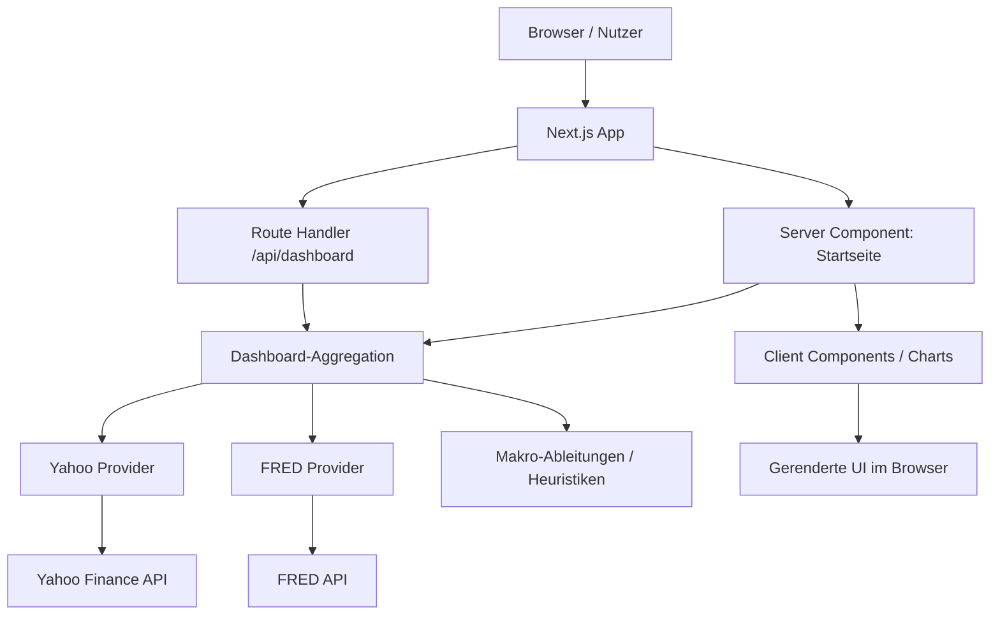
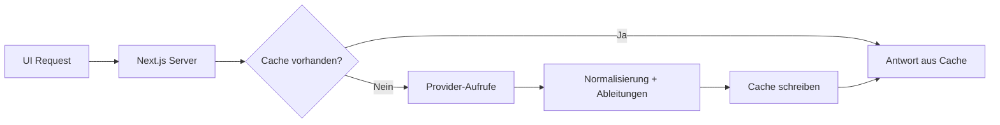
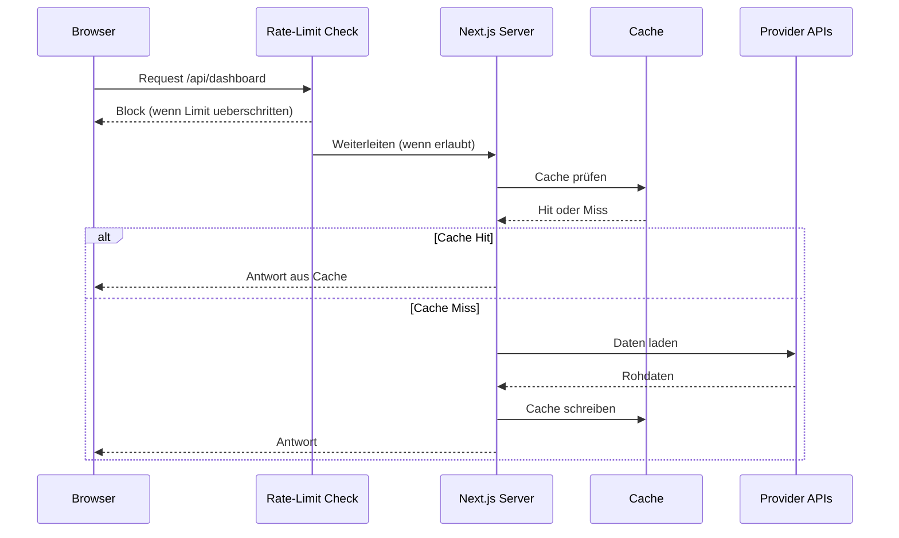

# MacroLens

Lernorientiertes Makro-Dashboard mit:
- `Next.js` (App Router)
- `TypeScript`
- `FRED API` (Makrozeitreihen, z. B. Fed Funds, Payrolls)
- `Yahoo Finance` (Marktdaten, z. B. S&P 500, Nasdaq 100, VIX, Öl)
- `Recharts` (Liniencharts)

Wichtig: Das Projekt ist als **Lern-MVP** aufgebaut. Die Code-Struktur soll verständlich sein, nicht maximal "clever".
Die eigentliche Next.js-App liegt bewusst unter `apps/web`, damit das Repo-Root aufgeräumt bleibt.

## Voraussetzungen

- Node.js `22.22.0` (siehe `apps/web/.nvmrc`)
- npm `10+`

Optional (empfohlen):
- FRED API Key für Makroserien aus FRED

## Quickstart

1. In den App-Ordner wechseln:

```bash
cd apps/web
```

2. Node-Version laden (falls du `nvm` nutzt):

```bash
nvm use
```

3. Abhängigkeiten installieren:

```bash
npm install
```

4. FRED API Key setzen (optional, aber empfohlen):

```bash
cp .env.example .env.local
```

Dann `FRED_API_KEY` in `.env.local` eintragen.

5. Dev-Server starten:

```bash
npm run dev
```

6. Öffnen:
- `http://localhost:3000` (UI)
- `http://localhost:3000/api/dashboard` (JSON-API)

## Docker (empfohlen fuer stabilen Dauerbetrieb)

Im Repo-Root:

```bash
docker compose up -d --build
```

Stoppen:

```bash
docker compose down
```

Logs:

```bash
docker compose logs -f web
```

Hinweis zu FRED:
- `FRED_API_KEY` kommt in die Shell-Umgebung vor dem Start, z. B.:

```bash
export FRED_API_KEY=dein_key
docker compose up -d --build
```

Das Compose-Setup nutzt `restart: unless-stopped`, damit der Container nach Reboots wieder hochkommt.
Hinweis: Auf dem Linux-Host wird die App absichtlich auf `127.0.0.1:3001` veröffentlicht, damit bestehende Dienste auf Port `3000` nicht gestört werden.
Wichtig fuer dieses Setup: `docker-compose.yml` setzt explizite DNS-Server (`1.1.1.1`, `8.8.8.8`), weil Docker hier zeitweise einen nicht aufloesbaren Upstream-Resolver uebernommen hatte und externe Datenquellen dann in der UI leer blieben.

## Remote Access Hinweis

`openclaw.tail027324.ts.net` und `owui.tail027324.ts.net` gehoeren zur separaten `ai_stack`-Topologie (OpenClaw/Open WebUI) und sind kein dauerhafter MacroLens-Endpunkt.

MacroLens selbst laeuft in diesem Repo per Docker auf:
- `http://127.0.0.1:3001`

## Kurz-Runbook: UI zeigt keine Daten

1. `docker compose ps` ausfuehren und pruefen, ob `web` healthy ist.
2. `curl -I http://127.0.0.1:3001` ausfuehren. Erwartet: `HTTP/1.1 200 OK`.
3. `curl http://127.0.0.1:3001/api/dashboard` pruefen:
   - Leere `points` mit `error: "fetch failed"` deuten hier auf ein Container-DNS-Problem hin.
4. `docker exec macrolens-web cat /etc/resolv.conf` pruefen:
   - Erwartet sind `ExtServers: [1.1.1.1 8.8.8.8]`.
5. Falls noetig: `docker compose up -d web` zum Neuerstellen des Services nach Compose-Aenderungen.

## Qualitäts-Checks (lokal)

```bash
npm run lint
npm test
npm run build
```

## Was du hier lernen kannst

- Wie eine `Next.js` Seite server-seitig Daten lädt
- Wie man mehrere APIs in ein gemeinsames Format normalisiert
- Wie React-Komponenten zusammenspielen
- Wie Charts in einer Client Component gerendert werden
- Wie man aus Rohdaten einfache makroökonomische Heuristiken ableitet
- Wann und warum man später eine Datenbank einführt

## Architektur (einfach)

1. `src/app/page.tsx`
   (im Repo: `apps/web/src/app/page.tsx`)
- Server Component
- ruft `getDashboardData()` auf

2. `apps/web/src/lib/providers/*`
- FRED/Yahoo-Fetching
- Parsing der Provider-Antworten

3. `apps/web/src/lib/dashboard-data.ts`
- Aggregiert alle Serien
- Baut Warnungen + Signale

4. `apps/web/src/lib/macro-derivations.ts`
- Heuristiken wie Trend, Breite, VIX-Regime, Öl-Impuls, Payroll-Momentum

5. `apps/web/src/components/*`
- Darstellung (UI + Charts)

## Architekturdiagramm (Mermaid)



Prinzip:
- `Next.js` ist hier **Frontend und Backend in einer App**.
- Externe Daten werden **serverseitig** geladen.
- Die UI bekommt bereits normalisierte Daten und Signale.

## Dateien zum Start (Lesereihenfolge)

1. `apps/web/src/app/page.tsx`
2. `apps/web/src/lib/dashboard-data.ts`
3. `apps/web/src/lib/providers/fred.ts`
4. `apps/web/src/lib/providers/yahoo.ts`
5. `apps/web/src/lib/macro-derivations.ts`
6. `apps/web/src/components/dashboard-client.tsx`
7. `apps/web/src/components/series-chart.tsx`

## Datenquellen

- FRED (Federal Reserve Economic Data): https://fred.stlouisfed.org/
- Yahoo Finance (über `yahoo-finance2` Node-Paket)

Hinweise:
- Yahoo ist praktisch, aber nicht so "offiziell stabil" wie FRED.
- Frequenzen unterscheiden sich (daily vs monthly), daher sind Vergleiche nur mit Kontext sinnvoll.

## Caching-Strategie (MVP, bewusst einfach)

Aktueller Stand:
- FRED-Fetch läuft mit `no-store` (immer frisch, keine Zwischenspeicherung durch `fetch`).
- Yahoo-Fetching läuft serverseitig über das Node-Paket.
- Es gibt **noch keine eigene Datenbank** und kein persistentes Cache-Layer.

Warum das für den Lern-MVP okay ist:
- Du siehst den Datenfluss direkt und unverfälscht.
- Weniger Komplexität (kein Cache-Invalidation-Thema, keine DB-Migrationen).
- Einfacher zu verstehen, woher Daten kommen und wo Fehler entstehen.

Späterer sinnvoller Ausbau:
- Kurzes Server-Cache-Fenster für Markt-/Makrodaten (z. B. Minutenbereich für UI-Aufrufe)
- Persistenter Cache / Historisierung über PostgreSQL + Prisma
- Unterschiedliche Cache-Regeln je Quelle/Frequenz (daily vs monthly)



## API-Abuse-Schutz / Rate-Limit (MVP-Plan)

Aktueller Stand:
- `/api/dashboard` ist vorhanden, aber ohne dediziertes Rate-Limit.
- Die Startseite nutzt primär den Server-Component-Flow (nicht zwingend Browser-API-Fetch).

Geplanter Minimal-Schutz (naechster Schritt, wenn extern deployed):
- Einfaches Rate-Limit pro IP / Zeitfenster auf `/api/dashboard`
- Kurzes Server-Caching, damit wiederholte Requests nicht ständig Provider aufrufen
- Logging von Fehlerhäufungen und ungewöhnlichen Zugriffsmustern



## Lern-Doku

- Grundlagen & Begriffe: `docs/learning-guide.md`
- Projekt-Navigation: `INDEX.md`
- Projektstatus / offene Punkte: `MEMORY.md`

## Nächste sinnvolle Ausbaustufen

1. Mehr FRED-Serien (CPI, Unemployment Rate, Yields, ISM)
2. Datenbank + Caching (Postgres/Prisma)
3. Zeitraum-Filter / Vergleichsmodi
4. Eigene Regel-Engine für Makro-Signale
